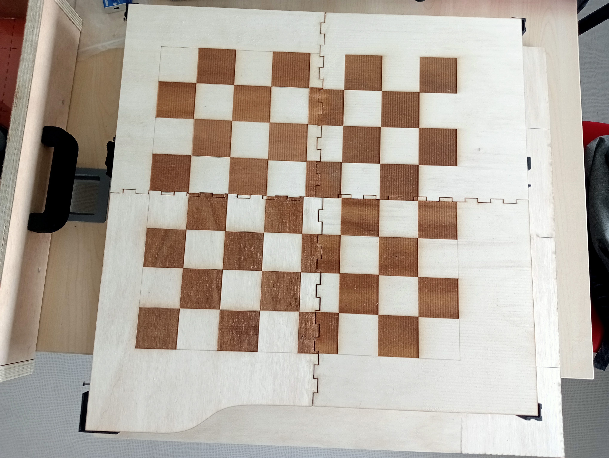
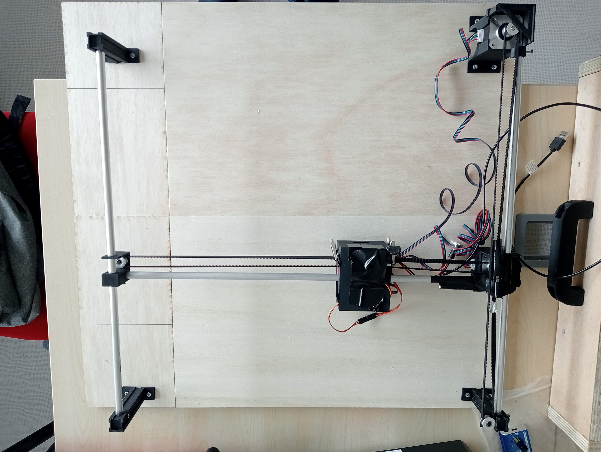

# Conception et prototypage

On a réalisé le plateau grâce à 4 planches de bois découpées au laser et graver au laser.
On a dessiné le motif (damier) sur Onshape puis on a pu graver grâce à la découpeuse.
On a assemblé les parties grâce à de la colle blanche (colle pour le bois). Voici ce que l'on a obtenu finalement :

Sous ce plateau se trouve le rail avec les pieds designer pour poser le plateau au dessus. Après insertion de courroies et d'interstices pour faire passer les tiges, on obtient le résultat final :

