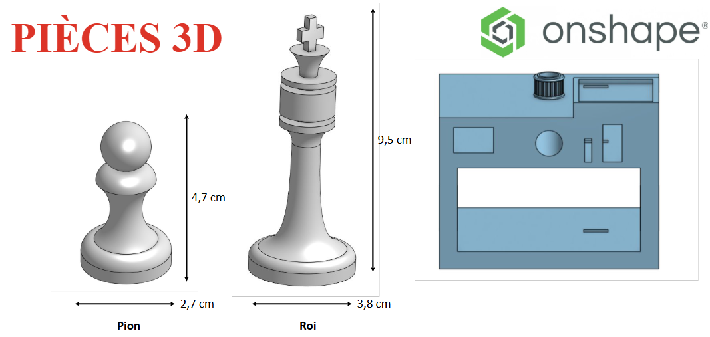
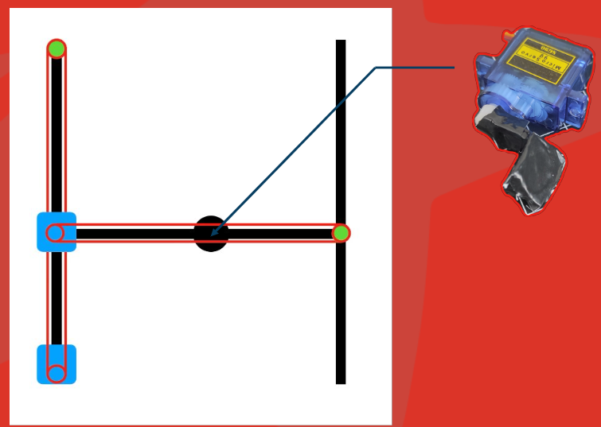
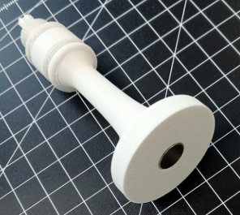
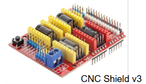
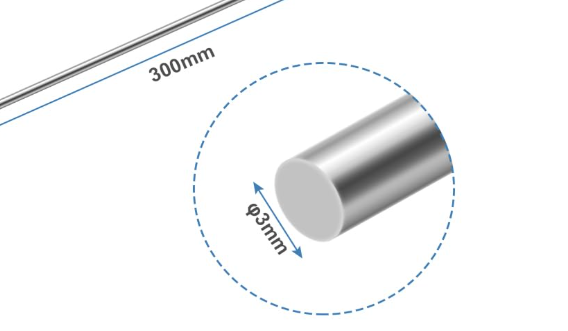
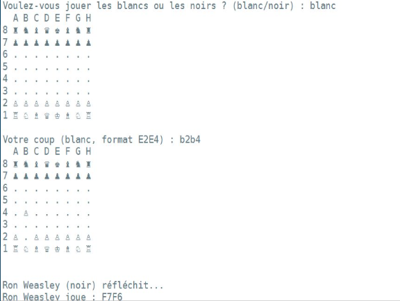

# Études et choix techniques

**Ici se trouve, les choix qui ont étés effectués pour faire avancer le projet.**

## Logiciels utilisés :

Nous avons utilisé **Github Desktop** pour faciliter l'utilisation,la gestion de codes et du site internet.
**Teams** pour communiquer facilement.
L'environement de développement **VS CODE** pour le programme Arduino et **PYZO** pour le programme python.
Le logiciel de modélisation utilisé est **Onshape**.

Pour adapter au mieux notre espace, on a fait imprimer en 3D chaque pièces du rail, ainsi que les pièces de jeu.

## Nous allons imprimer les pièces d'echecs et les éléments du rail grâce à l'imprimante 3D

Schéma du rail 2D se situant sous le plateau de jeu :

Au centre, on peut voir le chariot central qui portera le servomoteur (situé à droite de l'image) et qui elevera une platforme magnétique pour activer l'aimantation ou l'abaissera pour désactiver l'aimantation.

## Nous avons décidé de mettre en place un système de déplacement via activation ou désactivation de l'aimantation

Implentation d'aimant sous les pièces :

## Matériels utilisés et explications

Comme indiqué au-dessus nous avons besoin d'un servomoteur qui est contrôlé par la carte Arduino Uno en injectant un code qui contraint d'un angle indiqué ce moteur. En réalité ce moteur ne fait donc aucun tour sur lui-même mais il positionne la platforme aimanté de manière précise grâce à l'affectation d'un angle qui sera déterminé par des tests. On retient 2 angles d'utilisation : Un certain angle pour l'activation et un autre certain angle pour la désactivation.

Le déplacement du rail 2D situé sous l’échiquier nécessite l’utilisation de deux moteurs pas à pas, contrôlés par une carte Arduino UNO couplée à un CNC Shield, qui permet d’adapter les tensions nécessaires au bon fonctionnement des moteurs. Des drivers sont également utilisés afin de réguler et dissiper l’énergie produite par les moteurs, tout en assurant leur protection et leur stabilité pendant les déplacements.

On a utilisé des tiges pour consolider notre rail et faire que l'assemblage tienne le coup tout du long lors de l'utilisation lors d'une partie.
Les tiges utilisées sont en aluminium car elles sont légères et solides.

## Côté informatique

Nous avons décidé de re-programmer le jeu d'echec entièrement sous Python et ainsi ce qui nous a permis de développer une IA : **Ron Weasley** qui joue de la façon suivante : 
- Prend un pion adverse dès que c'est possible
- Sinon, il veille à ne pas mettre en danger une de ces pièces directement au prochain coup possible de l'adversaire

### Le code Python

Permet de donner une interface de jeu accessible et de visualiser l'etat du plateau numériquement. Il permet également de vérifier les coups rentrés et le bon déroulement du jeu.

### Le code Arduino

Ce code veille à la rotation des moteurs et à l'activation de l'aimantation selon les instructions du code Python (programme lourd).