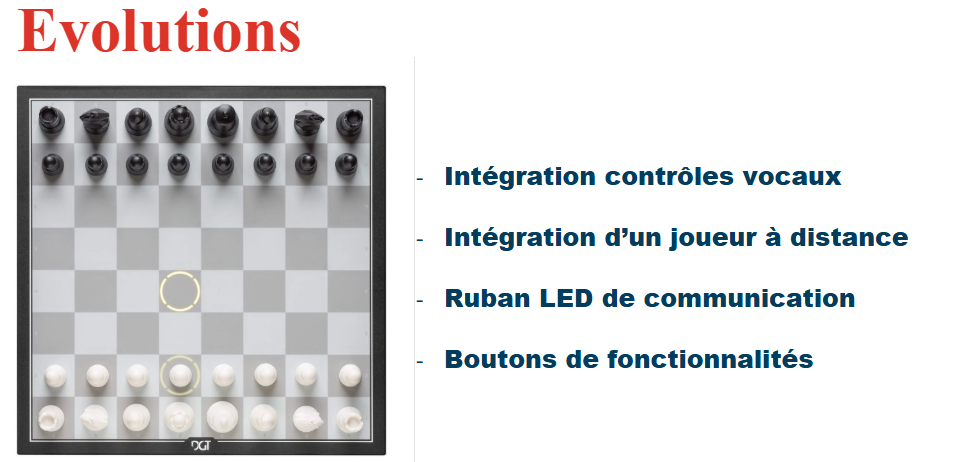

# Pistes d'évolution du projet

Notre projet a été réalisé dans un temps impartis. Mais si nous avions eu plus de temps, qu'aurai-t-on pu ajouter ? 

1. Une commande vocale
Nous pourrions intégrer une reconnaissance vocale permettant de donner ses coups au logiciel en la prononçant à heute voix. Cette fonctionnalité permettrait également de rapprocher les joueurs de l'expérience d'Harry Potter

2. Joueur à distance 
En plus de jouer contre Ron Weasley, on pourrait décider de jouer contre un joueur en distanciel. Ainsi, en plus 

3. Intégration d'une animation lumineuse 
Il serait intéressant de créer une interface homme/machine entre les joueurs et le plateau pour fluidifier la partie. Et cette interface pourrait être assez minimaliste comme un simple liseré de couleur autour du damier. 
On pourrait imaginer que lorsque qu'un joueur réfléchit, son côté du plateau est illuminé. Il pourrait y avoir de petites animations lorsque l'un des joueurs fait un coup décisif ou qu'il y a échec. Et bien évidemment un sinal lumineux de victoire.
Cette petite touche de couleur et de lumière permettrait de savoir où en est la partie sans l'intermédiaire d'un écran, pour ne pas interférer entre le joueur et le plateau physique. 

4. Boutons de fonctionnalités
Le plateau pourrait intégrer des boutons utiles comme : 
- un bouton "retour en arrière" pour retrouver la dispositions des pièces svant le coup joué
- un bouton permettant de définir une situation initiale. Les joueurs pourraient disposer les pièces comme ils le souhaitent et le bouton permettrait de commncer la partie de là.
- un bouton de sauvegarde qui enregistre la disposition des pièces pour reprendre la partie plus tard. 

