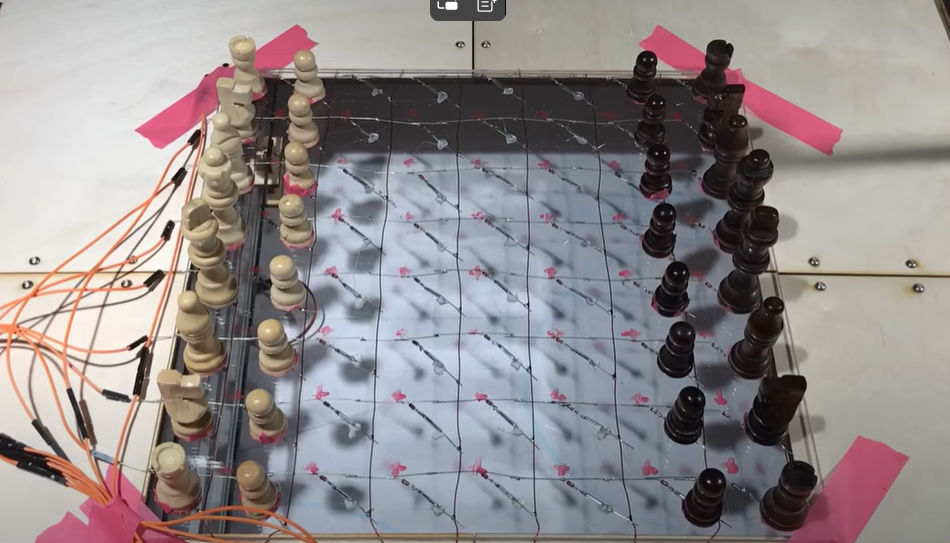
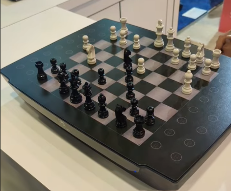

# Introduction

Dans le cadre de notre projet du second semestre, en tant qu’étudiants en 3e année (I3) à **UniLaSalle**, **campus d’Amiens**, nous travaillons sur la création d’un échiquier stylisé sur le thème de **Harry Potter**. Ce projet vise à respecter l’univers emblématique de la saga en intégrant un système de déplacement automatique des pièces, rendant l’expérience immersive et interactive.

## Contexte du Projet

Au début de notre second semestre 2025, en tant qu'étudiants de 3e année (I3) à **UniLaSalle Amiens**, nous avons choisi de travailler sur un projet intitulé **"Échecs version sorcier"**, inspiré de l’univers de Harry Potter. L'objectif principal est de concevoir un échiquier stylisé avec un système de déplacement automatique des pièces, en respectant l’esthétique et l’ambiance magique propres à cet univers.

Ce projet s’est déroulé sur une durée de 70 heures, réparties en séances dans les laboratoires informatiques et au sein du Makerspace, une salle spécialisée mise à notre disposition. Le Makerspace est équipé d’imprimantes 3D ainsi que de tout le matériel nécessaire pour réaliser nos impressions. Nous avons également utilisé des planches de bois de 50x30 cm pour construire la structure de notre échiquier.

En complément, nous avons eu accès au MacLab, un atelier entièrement équipé pour la fabrication manuelle et numérique. On y trouve les outils indispensables pour **souder**, **coller**, **poncer**, **visser**, ainsi qu’une découpeuse laser, utile pour la **découpe** ou la **gravure** de pièces en bois ou en acrylique.

Tout au long du projet, nous avons bénéficié de l’accompagnement de nos enseignants référents, **M. Bracq** et **M. Lacombe**, qui nous ont guidés dans les différentes étapes de conception et de réalisation. Une soutenance de mi-parcours a été organisée afin de présenter une première ébauche de notre travail, valider nos orientations techniques et pédagogiques, et recueillir des retours constructifs.

## Objectifs du Projet

L’objectif principal de notre projet est de concevoir **un échiquier interactif et automatisé**, intégrant une interface de jeu développée en Python. Ce système permettra de jouer une partie complète d’échecs contre une intelligence artificielle incarnant **Ron Weasley**, personnage emblématique de l’univers de **Harry Potter**, connu pour sa manière atypique et stratégique de jouer aux échecs dans la saga.

Notre échiquier doit offrir une expérience de jeu fluide, ludique et immersive, fidèle à l’esprit du jeu d’échecs version sorcier. L’utilisateur pourra choisir l’équipe qu’il souhaite contrôler (blancs ou noirs), et interagir avec le plateau tout au long de la partie. Les déplacements des pièces seront réalisés automatiquement, de manière précise et visible, pour renforcer l’aspect interactif et magique du jeu.

# Existant

Avant de lancer la conception de notre propre échiquier, nous avons étudié plusieurs projets existants. Cette démarche avait pour double objectif de valider la faisabilité technique de notre idée et d’identifier des solutions techniques réutilisables, que nous pourrions adapter à notre propre réalisation.

Nous nous sommes notamment appuyés sur des projets disponibles sur [Machine That Draws](https://makerspace-amiens.fr/machines-that-draws/), où sont présentés divers systèmes de dessin en 2D. Ces dispositifs utilisent un mécanisme de déplacement du crayon basé sur des rails, similaire à celui utilisé dans les imprimantes 3D. Ce principe de mouvement nous a inspirés pour concevoir notre propre système de déplacement des pièces sur l’échiquier, en adaptant cette méthode pour guider un outil ou un support magnétique avec précision.

Par ailleurs, nous avons identifié une vidéo d'un [projet étudiant](https://www.youtube.com/watch?v=JUX-hgx_V8Y) présentant brièvement un échiquier dont les pièces sont déplacées grâce à un système d’aimantation, une solution simple et efficace que nous avons également envisagée pour notre prototype.

Enfin, nous avons étudié le projet commercial [SQUARE OFF](https://www.youtube.com/watch?v=o2S4PgmExDY&t=19s), un échiquier connecté qui fonctionne via Wi-Fi ou Bluetooth grâce à une application dédiée. Il repose lui aussi sur un système d’aimantation pour déplacer les pièces automatiquement. Ce produit se distingue par sa compacité, son silence de fonctionnement, et son ergonomie, ce qui nous a donné des repères concrets pour évaluer notre propre conception en termes de design et de performance.

# Cahier des Charges

La restitution finale du projet comprend la livraison de plusieurs livrables :
- Un prototype d'échiquier et de son système fonctionnel,

- Un site internet regroupant la documentation technique et une notice d’utilisation,

- Une vidéo de présentation illustrant le fonctionnement de notre échiquier,

- Un powerpoint et d'une soutenance de fin de projet,
